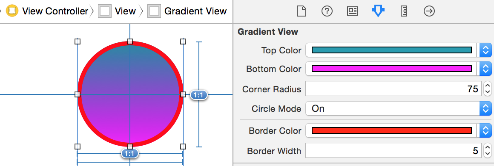
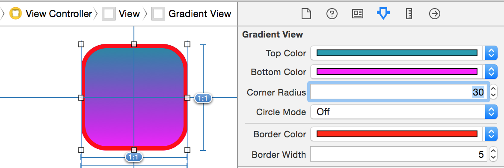

# CustomViewRenderer

A little example on how to use IBInspectable and IB_DESIGNABLE in ObjectiveC to create a custom UIView that can be renderized inside Interface Builder.

[Apple Docs](https://developer.apple.com/library/ios/recipes/xcode_help-IB_objects_media/Chapters/CreatingaLiveViewofaCustomObject.html)

##Screenshots

